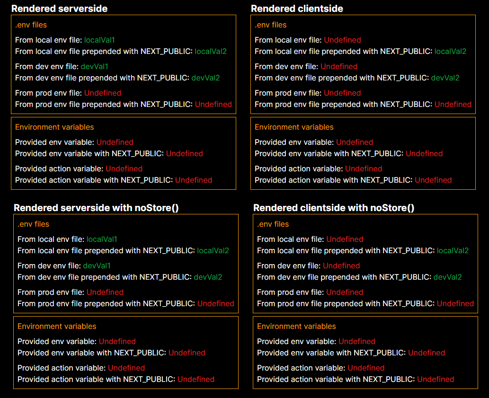
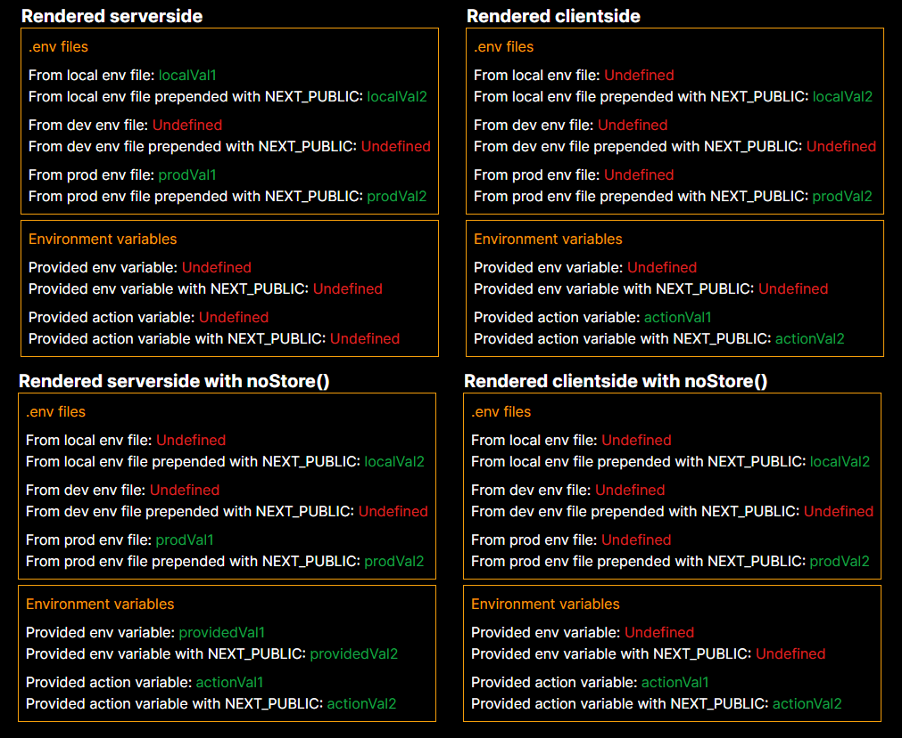

# Environment variables in Next.js example
This example project aims to showcase how environment variables are handled in Next.js currently. It displays how .env files and provided environment variables are rendered client and serverside.

A greater explanation on how environment variables in Next.js works can be found [here](https://google.com).

## Running the example
This example can be run simply by using `npm run dev`. It is then accessible at http://localhost:3000.

It is also a good idea to build and run it as a docker image so you can test how it behaves with environment variables:
1. To build: `docker build -f dockerfile -t env-variables-in-nextjs .`
2. To run: `docker run --rm -e providedVariable=providedVal1 -e NEXT_PUBLIC_PROVIDED_VARIABLE=providedVal2 -e actionVariable=actionVal1 -e NEXT_PUBLIC_actionVariable=actionVal2 -p 3001:3000 env-variables-in-nextjs`
3. The project should then be accessible at http://localhost:3001.

Be aware that the `npm run dev` version and docker version run on separate ports, so you can test and see the difference.

## Understanding the example
The example code shows how `process.env.{name}` variables are rendered by Next.js. There is a root page and one that can be accessed at `/nostore` which shows how `unstable_noStore()` effects the rendering.

### Rendering in devmode (npm run dev)
The below image displays how the example prints out rendering in dev mode. The result from the source page has been spliced with the one at `/nostore`:

From this result we can understand:
* Serverside
  * Env files are accessible.
  * Env file variables are accessible with or without being prepended with NEXT_PUBLIC.
  * No environment variables are provided and can therefore not be displayed.

* Clientside
  * Only env file variables prepended with NEXT_PUBLIC can be displayed.
  * No environment variables are provided and can therefore not be displayed.

The below image displays how the example prints out rendering in being hosted in a docker image. The result from the source page has been spliced with the one at `/nostore`:

From this result we can understand:
* Serverside
  * Local and prod env files are accessible. Dev env file is no longer accessible.
  * Provided env variables are not rendered when not using `noStore()`. This is because this page was decided at compile-time when the docker image was created.
  * When using `noStore()` we can both get provided environment variables when using them directly or through a server action. This is possible because the page is being rendered dynamically when requested.

* Clientside
  * Only env file variables are accessible when prepended with NEXT_PUBLIC.
  * `noStore()` does not have an effect since `use client` pages are rendered clientside and not on the server.
  * Provided environment variables are accessible using a server action.

## Conclusion
It is best to use `noStore()` serverside to handle provided environment variables obviously. Being forced to use the serverside action isn't ideal because the request will be async and awkward to handle in a client component.
